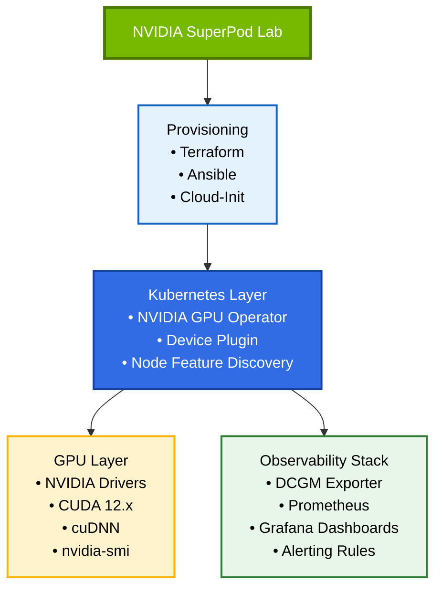
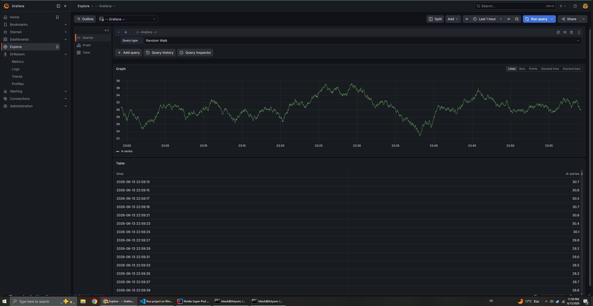

# 🐸 NVIDIA SuperPod — GPU Infrastructure Lab
> A hands-on infrastructure project simulating enterprise-grade NVIDIA GPU cluster provisioning, orchestration, and observability 

Built on AWS using Terraform, Ansible, Cloud-Init, and Kubernetes.
- Automated deployment of NVIDIA GPU Operator, device plugins, CUDA runtime, and observability stack (DCGM Exporter, Prometheus, Grafana).
- GPU monitoring, alerting, and AI workload execution for PyTorch and LLM inference workloads.


---

## 📋 Overview

This project provisions and operates a GPU-accelerated infrastructure stack modelled after NVIDIA's DGX SuperPod reference architecture. It covers driver management, CUDA toolkit integration, Kubernetes GPU orchestration via the NVIDIA GPU Operator, and end-to-end observability using DCGM Exporter, Prometheus, and Grafana.

**Target environments:**
- AWS EC2 GPU instances (`g4dn.xlarge` / `p3.2xlarge`)
- Local Kubernetes clusters (kind / minikube with GPU passthrough)
- Expandable to bare-metal Linux nodes

---

## 🏗️ Architecture



For more details visit [docs/architecture](./docs/architecture.md)

---

## 🛠️ Stack

| Layer                    | Technology                                           |
|--------------------------|------------------------------------------------------|
| Cloud                    | AWS EC2 (`g4dn`, `p3`)                               |
| IaC                      | `Terraform`                                          |
| Configuration Management | `Ansible`                                            |
| Container Orchestration  | `Kubernetes` (kubeadm single-node / kind local)      |
| GPU Operator             | `NVIDIA GPU Operator`                                |
| GPU Monitoring           | `DCGM Exporter`                                      |
| Metrics                  | `Prometheus`                                         |
| Dashboards & Alerts      | `Grafana`                                            |
| Workloads                | `PyTorch`, `CUDA Samples`, `Triton Inference Server` |
| Profiling                | `Nsight Systems`, `nvidia-smi`                       |

---

## 📁 Project Structure

```
nvidia-superpod/
├── terraform/
│   ├── main.tf                    # Root: VPC + GPU node wiring
│   ├── variables.tf               # All input variables with descriptions
│   ├── outputs.tf                 # Useful outputs (IPs, URLs, commands)
│   └── modules/
│       ├── vpc/                   # VPC, subnets, IGW, NAT GW, flow logs
│       └── gpu-node/              # EC2, EBS, IAM, SG, EIP, CW alarms
├── ansible/
│   ├── ansible.cfg                # SSH settings, inventory path
│   ├── inventory/
│   │   ├── aws_ec2.yml            # Dynamic inventory from EC2 tags
│   │   └── hosts.yml              # Static fallback
│   ├── group_vars/
│   │   └── gpu_nodes.yml          # Version pins mirroring terraform/variables.tf
│   └── playbooks/
│       ├── 01-bootstrap-k8s.yml   # kubeadm init, Flannel CNI, node label
│       ├── 02-deploy-stack.yml    # Helm installs in order
│       ├── 03-apply-workloads.yml # CUDA validation, Triton, PyTorch benchmark
│       ├── 04-upgrade-driver.yml  # Day-2: safe driver version swap
│       └── 05-validate.yml        # End-to-end 7-check health report
├── kubernetes/
│   ├── base/
│   │   └── namespaces.yaml        # gpu-operator, monitoring, inference, training
│   ├── gpu-operator/
│   │   └── values.yaml            # GPU Operator Helm values (driver.enabled=false)
│   ├── dcgm-exporter/
│   │   └── values.yaml            # DCGM Exporter Helm values + ServiceMonitor
│   └── monitoring/
│       ├── prometheus/
│       │   └── values.yaml        # kube-prometheus-stack Helm values
│       └── grafana/
│           └── dashboards/
│               └── gpu-cluster.json  # 11-panel GPU metrics dashboard
├── workloads/                      # Optional — apply after core stack is healthy
│   ├── cuda-test.yaml             # Job: nvidia-smi, deviceQuery, bandwidthTest
│   ├── pytorch-job.yaml           # Job: ResNet-50 throughput benchmark
│   └── triton.yaml                # Deployment + Service + ServiceMonitor
├── runbooks/
│   ├── 01-driver-install.md       # Manual driver install & validation
│   ├── 02-cuda-setup.md           # CUDA 12-3 setup & cuDNN
│   ├── 03-gpu-operator.md         # GPU Operator deploy & verify
│   └── 04-observability.md        # DCGM + Prometheus + Grafana
└── docs/
    ├── architecture.md            # Full layer diagram & design decisions
    ├── benchmarks.md              # T4 bandwidth, compute, DCGM baselines
    ├── lessons-learned.md         # Operational lessons from building this stack
    └── HardwareRequirement.md     # Hardware specs, instance upgrade path, local dev options
```

---

# ▶️ Getting Started

## ⚡ Prerequisites

### ℹ️  [supported Hardware](./HARDWARE.md) 
Check what hardware is supported `Linux > Windows > Macbook`

### 👨🏻‍💻 **[Running Locally](./docs/RunningLocally.md)**
Check what Development & Testing steps you can do locally on `Linux/Windows/Macbook`

### 🖥️ **Softwares**

Required tools
- terraform >= 1.5
- ansible >= 2.14
- kubectl >= 1.28
- helm >= 3.12
- aws-cli >= 2.x

### Install Tools macOS

```bash
    
    brew install terraform ansible kubectl helm awscli
    
    # Python deps for Ansible dynamic inventory
    pip install boto3 botocore
    ansible-galaxy collection install amazon.aws kubernetes.core
    
    
    # Verify
    terraform version   # >= 1.5
    ansible --version   # >= 2.14
    helm version        # >= 3.12
    aws configure       # set your Access Key, Secret, region: eu-central-1

```

---

### Install Tools Windows

> **Note:** Terraform and AWS CLI run on Windows. Ansible must run inside WSL2 — it is Linux-only.

**1. AWS CLI (Windows)**

Download and run the MSI: `https://awscli.amazonaws.com/AWSCLIV2.msi`

```cmd
    # Verify
    aws --version   # aws-cli/2.x
```

**2. Terraform (Windows)**

Download the zip from `https://developer.hashicorp.com/terraform/install` → Windows → AMD64.
Extract `terraform.exe` to `C:\terraform\` then add to PATH:

```powershell
    # Run as Administrator
    [Environment]::SetEnvironmentVariable("PATH", $env:PATH + ";C:\terraform", "Machine")
```

Restart your terminal, then verify:
```cmd
    terraform version   # >= 1.5
```

**3. SSH Key (Windows CMD)**

```cmd
    mkdir "%USERPROFILE%\.ssh"
    ssh-keygen -t rsa -b 4096 -f "%USERPROFILE%\.ssh\id_rsa"
    
    # View and copy your public key
    type "%USERPROFILE%\.ssh\id_rsa.pub"
```

**4. AWS Credentials (Windows CMD)**

```cmd
    aws configure
    # Enter: Access Key ID, Secret Access Key, region (eu-central-1), output (json)
    
    # Verify
    aws sts get-caller-identity
```

**5. Ansible + Helm + kubectl (WSL2 Ubuntu)**

Ansible is Linux-only. Open WSL2 (`wsl` from Start menu) and run:

```bash
    # Remove old apt ansible (too old — must be >= 2.14)
    sudo apt remove ansible -y
    pip3 install --user ansible
    echo ‘export PATH="$PATH:$HOME/.local/bin"’ >> ~/.bashrc
    source ~/.bashrc
    ansible --version   # ansible core 2.17+
    
    # kubectl
    curl -LO "https://dl.k8s.io/release/$(curl -L -s https://dl.k8s.io/release/stable.txt)/bin/linux/amd64/kubectl"
    sudo install -o root -g root -m 0755 kubectl /usr/local/bin/kubectl
    
    # helm
    curl https://raw.githubusercontent.com/helm/helm/main/scripts/get-helm-3 | bash
```

**6. Copy SSH key into WSL2 with correct permissions**

Windows SSH keys have 0777 permissions which SSH rejects inside WSL2. Copy and fix:

```bash
    mkdir -p ~/.ssh
    cp /mnt/c/Users/<your-windows-username>/.ssh/id_rsa ~/.ssh/id_rsa_superpod
    chmod 600 ~/.ssh/id_rsa_superpod
```

**7. Point kubectl at Docker Desktop cluster (if using local Kubernetes)**

```bash
    export KUBECONFIG=/mnt/c/Users/<your-windows-username>/.kube/config
    echo ‘export KUBECONFIG=/mnt/c/Users/<your-windows-username>/.kube/config’ >> ~/.bashrc
```


---

## 👩🏻‍💻 Build Steps

Total time from zero to running cluster

| Phase                               | Time    |
|-------------------------------------|---------|
| Terraform apply                     | ~3 min  |
| cloud-init (runs in background)     | ~5 min  |
| Ansible playbook 01 (k8s bootstrap) | ~5 min  |
| Ansible playbook 02 (Helm stack)    | ~12 min |
| Ansible playbook 03 (workloads)     | ~3 min  |
| **Total**                           | **~28 min** |

Cost for one session: 28 min × $0.18/hr ≈ $0.08

---

### 1. 🏗️ Provision Infrastructure (Terraform)

**Run from Windows CMD:**

```cmd
    cd /d e:\WorkSpace\GitHub\Nvidia-Super-Pod\terraform
    cp terraform.tfvars.example terraform.tfvars
```

Edit `terraform.tfvars` with your values:

```hcl
    ssh_public_key    = "ssh-rsa AAAA..."      # ← output of: type "%USERPROFILE%\.ssh\id_rsa.pub"
    allowed_ssh_cidrs = ["YOUR.IP/32"]         # ← output of: curl https://checkip.amazonaws.com
```

```cmd
    terraform init
    terraform plan
    terraform apply -auto-approve
```


<details>

<summary>Output Result</summary>

```bash
    Apply complete! Resources: 34 added, 1 changed, 0 destroyed.
    
    Outputs:
    
    ami_id = "ami-0c42a2b384b315690"
    availability_zone = "eu-central-1a"
    dcgm_metrics_url = "http://3.123.156.112:9400/metrics"
    gpu_node_instance_id = "i-06d7dda5074fc071c"
    gpu_node_public_ip = "3.123.156.112"
    grafana_url = "http://3.123.156.112:3000"
    instance_type = "t3.medium"
    prometheus_url = "http://3.123.156.112:9090"
    ssh_command = "ssh -i ~/.ssh/id_rsa ubuntu@3.123.156.112"
    validate_gpu_command = "nvidia-smi && nvcc --version && ./scripts/validate-gpu.sh"
    vpc_id = "vpc-0a194128b7cd91074"
    
```    
</details>

Note the outputs — you'll need `gpu_node_public_ip` for the next steps.

```bash
    gpu_node_public_ip = "x.x.x.x"
    ssh_command        = "ssh -i ~/.ssh/id_rsa ubuntu@x.x.x.x"
    grafana_url        = "http://x.x.x.x:30300"
```

#### ⚠️ GPU vCPU limit error on new AWS accounts

New AWS accounts start with 0 GPU vCPUs. If you see:
> `VcpuLimitExceeded: You have requested more vCPU capacity than your current vCPU limit of 0`

Request an increase:
- AWS Console → Service Quotas → EC2 → search **"Running On-Demand G and VT instances"**
- Request **4 vCPUs** minimum → Submit (approved in a few hours to 1 business day)

While waiting, test with a non-GPU instance by setting in `terraform.tfvars`:

```hcl
    instance_type     = "t3.medium"
    use_spot_instance = false
```

#### ⚠️ CloudWatch log group already exists error

If a previous failed apply left an orphaned log group:
```cmd
    terraform import module.vpc.aws_cloudwatch_log_group.flow_logs[0] /aws/vpc/superpod-flow-logs
    terraform apply
```


---

### 2. ⏳ Wait for `cloud-init ` (Windows CMD)

SSH into deployed EC2 Node using `gpu_node_public_ip`:

```cmd
    ssh -i "%USERPROFILE%\.ssh\id_rsa" ubuntu@<NODE_IP>
```

Watch `cloud-init` progress (runs automatically on first boot, ~5 min):

```bash
  sudo tail -f /var/log/cloud-init-output.log
```

cloud-init installs: `NVIDIA Driver 535`, `CUDA 12-3`, `Docker`, `NVIDIA Container Toolkit`, `kubectl`, `Helm`, `DCGM`. 

No manual driver steps required.

---

### 3. 🥾 Bootstrap Kubernetes (Ansible — run from WSL2)

> All Ansible commands run inside WSL2, not Windows CMD.

Update [ansible/inventory/hosts.yml](./ansible/inventory/hosts.yml) with your node IP:

```yaml
    ansible_host: "x.x.x.x"                              # ← gpu_node_public_ip from terraform output
    ansible_ssh_private_key_file: ~/.ssh/id_rsa_superpod  # ← WSL2 copy of your Windows SSH key
```

### All at Once in case of Disaster recovery (Run from WSL2) 

```bash

    sleep 20 && \
    ssh -i ~/.ssh/id_rsa_superpod ubuntu@3.123.156.112 "sudo sed -i '/^export PATH/d' /etc/environment && sudo sed -i '/^export LD_LIBRARY/d' /etc/environment && sudo rm -f /etc/containerd/config.toml && sudo containerd config default | sudo tee /etc/containerd/config.toml && sudo sed -i 's/SystemdCgroup = false/SystemdCgroup = true/' /etc/containerd/config.toml && sudo systemctl restart containerd && sudo modprobe br_netfilter && echo br_netfilter | sudo tee /etc/modules-load.d/br_netfilter.conf && sudo sysctl -w net.bridge.bridge-nf-call-iptables=1 && echo ALL_FIXES_DONE" && \
    ansible-playbook -i /mnt/e/WorkSpace/GitHub/Nvidia-Super-Pod/ansible/inventory/hosts.yml /mnt/e/WorkSpace/GitHub/Nvidia-Super-Pod/ansible/playbooks/01-bootstrap-k8s.yml && \
    ansible-playbook -i /mnt/e/WorkSpace/GitHub/Nvidia-Super-Pod/ansible/inventory/hosts.yml /mnt/e/WorkSpace/GitHub/Nvidia-Super-Pod/ansible/playbooks/02-deploy-stack.yml


```

Or do it gradually first:

### 3.1. ☸️ Deploy the Kubernetes (Ansible) 

```bash

    # Verify Ansible can reach the node
    ansible gpu_nodes \
      -i /mnt/e/WorkSpace/GitHub/Nvidia-Super-Pod/ansible/inventory/hosts.yml \
      -m ping
    
    # Bootstrap Kubernetes
    ansible-playbook \
      -i /mnt/e/WorkSpace/GitHub/Nvidia-Super-Pod/ansible/inventory/hosts.yml \
      /mnt/e/WorkSpace/GitHub/Nvidia-Super-Pod/ansible/playbooks/01-bootstrap-k8s.yml
      
```

Expected result: node shows `Ready` status.

```
NAME           STATUS   ROLES           AGE   VERSION
ip-10-0-1-x   Ready    control-plane   71s   v1.29.15
```

<details>

<summary>Output Result</summary>

      hitesh@Artyom:/mnt/c/Users/sagar$ kubectl get pods -n monitoring
      NAME                                                   READY   STATUS    RESTARTS   AGE
      prometheus-grafana-67d49c8d9c-hpfxq                    3/3     Running   0          7m24s
      prometheus-kube-prometheus-operator-7ff545b6fb-p5qgb   1/1     Running   0          7m24s
      prometheus-kube-state-metrics-6cc7c56db5-dd4w4         1/1     Running   0          7m24s
      prometheus-prometheus-node-exporter-b86pv              1/1     Running   0          7m24s

</details>

---

### 3.2. 🧮 Deploy the full stack (Ansible)

### Deploy GPU Operator + kube-prometheus-stack + DCGM Exporter via Ansible

```bash

    # Playbook 02: GPU Operator + kube-prometheus-stack + DCGM Exporter
    ansible-playbook playbooks/02-deploy-stack.yml
    # ~12 min — waits for each Helm release before proceeding
    
    
     helm install prometheus prometheus-community/kube-prometheus-stack   --namespace monitoring  -f /mnt/e/WorkSpace/GitHub/Nvidia-Super-Pod/kubernetes/monitoring/prometheus/values.yaml   --wait --timeout=10m

```

<details>

<summary>Output Result</summary>

      hitesh@Artyom:/mnt/c/Users/sagar$ kubectl get pods -n monitoring
      NAME                                                   READY   STATUS    RESTARTS   AGE
      prometheus-grafana-67d49c8d9c-hpfxq                    3/3     Running   0          7m24s
      prometheus-kube-prometheus-operator-7ff545b6fb-p5qgb   1/1     Running   0          7m24s
      prometheus-kube-state-metrics-6cc7c56db5-dd4w4         1/1     Running   0          7m24s
      prometheus-prometheus-node-exporter-b86pv              1/1     Running   0          7m24s

</details>


### 4. 📟 Access services

All pods are Running. Access Grafana via port-forward:

> kubectl port-forward -n monitoring svc/prometheus-grafana 3000:80

Then open in your browser:
[http://localhost:3000](http://localhost:3000)

### Login: admin / superpod-changeme




Get IP of GPU Node

> NODE_IP=$(cd terraform && terraform output -raw gpu_node_public_ip)


```bash

    # Grafana dashboard
    open http://$NODE_IP:30300
    # Login: admin / superpod-changeme
    
    # Triton health check
    curl http://$NODE_IP:30800/v2/health/ready
    
    # SSH into the node
    ssh -i ~/.ssh/id_rsa ubuntu@$NODE_IP
    nvidia-smi

```

###  If you prefer manually

```bash
    helm repo add nvidia https://helm.ngc.nvidia.com/nvidia && helm repo update
    
    # Label the node first (required on single-node clusters)
    kubectl label node $(kubectl get nodes -o jsonpath='{.items[0].metadata.name}') \
      nvidia.com/gpu.present=true
    
    #  Add GPU Operator
    helm install gpu-operator nvidia/gpu-operator \
      --namespace gpu-operator \
      --version v24.3.0 \
      -f kubernetes/gpu-operator/values.yaml \
      --wait --timeout=10m

    
    # Add Helm repos
    helm repo add prometheus-community https://prometheus-community.github.io/helm-charts
    helm repo add gpu-helm-charts https://nvidia.github.io/dcgm-exporter/helm-charts
    helm repo update

    # Prometheus + Grafana + node-exporter
    helm install prometheus prometheus-community/kube-prometheus-stack \
      --namespace monitoring \
      -f kubernetes/monitoring/prometheus/values.yaml \
      --wait --timeout=10m

    # DCGM Exporter (GPU hardware metrics)
    # Note: chart moved from nvidia/ to gpu-helm-charts/ in 2024
    helm install dcgm-exporter gpu-helm-charts/dcgm-exporter \
      --namespace monitoring \
      --version 4.8.2 \
      -f kubernetes/dcgm-exporter/values.yaml \
      --wait
```

---

### 5. 🚀 Deploy Workloads (From WSL2)

> Requires a GPU node (`g4dn.xlarge` or similar). Skip on `t3.medium`.

```bash
    ansible-playbook \
      -i /path/to/ansible/inventory/hosts.yml \
      /path/to/ansible/playbooks/03-apply-workloads.yml
    
    
     # Example apply-workloads but skipping CUDA 
     ansible-playbook \
     /mnt/>   -i /mnt/e/WorkSpace/GitHub/Nvidia-Super-Pod/ansible/inventory/hosts.yml \
    >   /mnt/e/WorkSpace/GitHub/Nvidia-Super-Pod/ansible/playbooks/03-apply-workloads.yml \
    >   --skip-tags cuda
```


### 6. 🪂 Validate Deployment (WSL2)

Validate end-to-end health:

```bash
    
    ansible-playbook \
      -i /path/to/ansible/inventory/hosts.yml \
      /path/to/ansible/playbooks/05-validate.yml
    
     # Example 
    ansible-playbook \
      -i /mnt/e/WorkSpace/GitHub/Nvidia-Super-Pod/ansible/inventory/hosts.yml \
      /mnt/e/WorkSpace/GitHub/Nvidia-Super-Pod/ansible/playbooks/05-validate.yml
    ```
    
    Manually verify GPU resources and run CUDA validation:
    
    ```bash
    # Check GPU is allocatable
    kubectl get nodes -o jsonpath='{.items[*].status.allocatable.nvidia\.com/gpu}'
    # Expected: 1
    
    # Run CUDA validation job
    kubectl apply -f kubernetes/workloads/cuda-test.yaml
    
    kubectl wait job/cuda-validation -n training --for=condition=complete --timeout=5m
    
    kubectl logs -n training job/cuda-validation
    # Expected last line: All GPU validation checks PASSED.
```


Optional — Run GPU benchmarks Pytorch

```bash
    # PyTorch ResNet-50 throughput benchmark
    ansible-playbook playbooks/03-apply-workloads.yml --tags pytorch
    # Reports ~320 samples/sec on T4

```

---- 

## ⛔ Clean up

> ### ⚠️ DO NOT forget to clean up otherwise you will end up with Huge AWS bill


Teardown — stop paying immediately

```bash
    cd terraform/
    terraform destroy
    # Terminates the EC2 instance, releases EIP, deletes EBS volumes.
    # Cost drops to ~$0 (NAT Gateway and EIP are also destroyed).

```

---

## 📊 Key Metrics Monitored

| Metric                          | Description                                    |
|---------------------------------|------------------------------------------------|
| `DCGM_FI_DEV_GPU_UTIL`          | GPU compute utilization %                      |
| `DCGM_FI_DEV_MEM_COPY_UTIL`     | Memory bandwidth utilization                   |
| `DCGM_FI_DEV_FB_USED`           | GPU framebuffer memory used                    |
| `DCGM_FI_DEV_POWER_USAGE`       | Power draw per GPU                             |
| `DCGM_FI_DEV_SM_CLOCK`          | SM clock frequency                             |
| `DCGM_FI_DEV_GPU_TEMP`          | GPU temperature                                |
| `DCGM_FI_DEV_ECC_SBE_VOL_TOTAL` | Single-bit ECC errors (early hardware warning) |

---

## 🔬 Workload Profiling

```bash

    # Quick utilization snapshot (1-second polling)
    nvidia-smi dmon -s u -d 1
    
    # Continuous GPU stats
    watch -n 1 nvidia-smi \
      --query-gpu=utilization.gpu,utilization.memory,memory.used,memory.free,temperature.gpu,power.draw \
      --format=csv,noheader,nounits
    
    # Run the PyTorch ResNet-50 benchmark and tail results
    kubectl apply -f workloads/pytorch/pytorch-job.yaml
    kubectl logs -n training job/pytorch-benchmark -f
    
```

---

## 📖 Runbooks

Step-by-step operational guides live in `/runbooks/`:

- [Driver Installation & Validation](runbooks/01-driver-install.md)
- [CUDA Toolkit Setup](runbooks/02-cuda-setup.md)
- [GPU Operator Deployment](runbooks/03-gpu-operator.md)
- [Observability Stack Setup](runbooks/04-observability.md)

---

## 📈 Benchmark Results

| Test                          | Hardware            | Result           |
|-------------------------------|---------------------|------------------|
| Host-to-Device bandwidth      | T4 (g4dn.xlarge)    | ~12.0 GB/s       |
| Device-to-Host bandwidth      | T4 (g4dn.xlarge)    | ~12.8 GB/s       |
| Device-to-Device bandwidth    | T4                  | ~255 GB/s        |
| CUDA deviceQuery              | T4                  | PASSED           |
| ResNet-50 training throughput | T4 (batch=64, fp32) | ~320 samples/sec |
| ResNet-50 step latency        | T4 (batch=64, fp32) | ~200 ms/step     |

---

## 🎯 Key Learnings

- Driver 535 is the minimum for CUDA 12.x — always check the [CUDA compatibility matrix](https://docs.nvidia.com/cuda/cuda-toolkit-release-notes/) before upgrading either
- When drivers are pre-installed by cloud-init, set `driver.enabled: false` in the GPU Operator — letting the operator re-install causes a version-check conflict that stalls the operator indefinitely
- On single-node clusters, label the node `nvidia.com/gpu.present=true` manually before installing the GPU Operator — NFD cannot self-label until the operator is running (deadlock)
- Set `serviceMonitorSelectorNilUsesHelmValues: false` in kube-prometheus-stack or Prometheus silently ignores ServiceMonitors outside its own namespace, including DCGM Exporter
- The T4 TDP is 70 W — alert thresholds above that will never fire; check GPU specs before copying alert rules from a different instance family
- GPU utilisation below 10% during a training job almost always means the DataLoader is the bottleneck, not the GPU

---

## 🔗 References

- [NVIDIA GPU Operator Docs](https://docs.nvidia.com/datacenter/cloud-native/gpu-operator/latest/index.html)
- [DCGM Exporter](https://github.com/NVIDIA/dcgm-exporter)
- [CUDA Compatibility Matrix](https://docs.nvidia.com/cuda/cuda-toolkit-release-notes/)
- [NVIDIA DGX SuperPod Reference Architecture](https://docs.nvidia.com/dgx-superpod/)
- [Kubernetes GPU Scheduling](https://kubernetes.io/docs/tasks/manage-gpus/scheduling-gpus/)

---

## 👤 Author

**Hitesh Sahu** — Senior Cloud Infrastructure & DevOps Architect
[hiteshsahu.com](https://hiteshsahu.com) · [LinkedIn](https://linkedin.com/in/hiteshsahu) · [GitHub](https://github.com/hiteshsahu)

> *Built as part of hands-on AI infrastructure exploration, aligned with NVIDIA DLI certifications in AI Infrastructure & Operations, Generative AI LLMs, and Agentic AI.*
