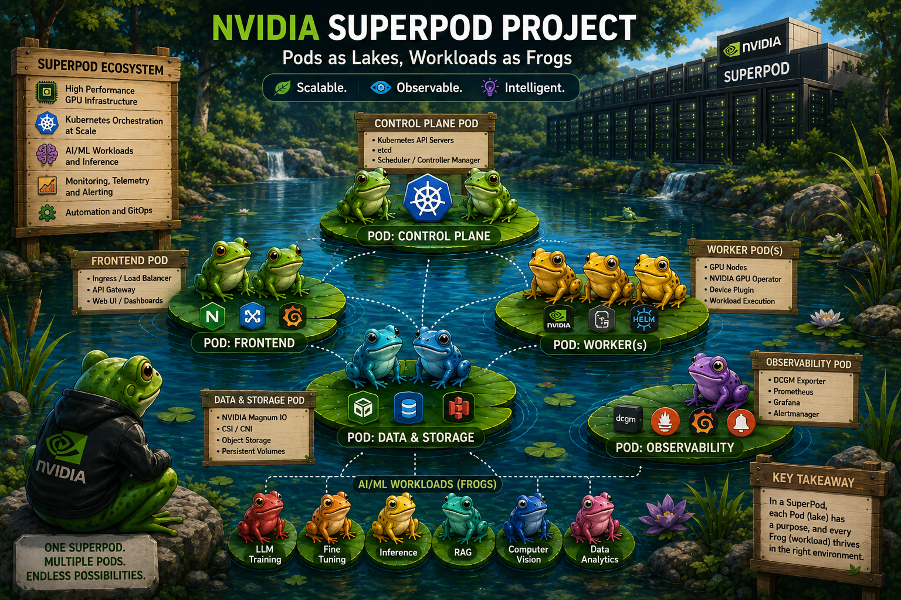
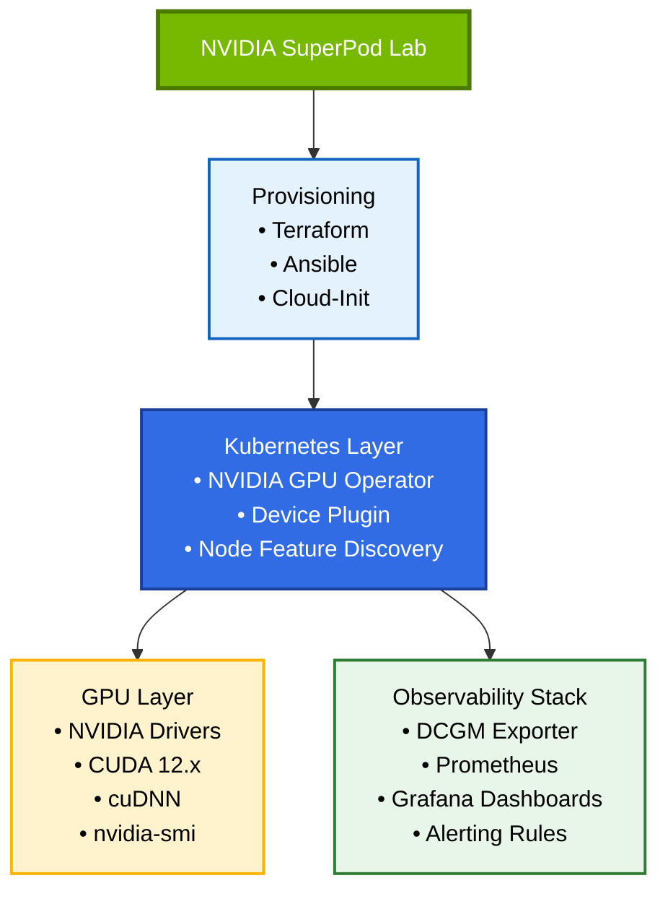

# 🐸 NVIDIA SuperPod — GPU Infrastructure Lab
> A hands-on infrastructure project simulating enterprise-grade NVIDIA GPU cluster provisioning, orchestration, and observability 

Built on AWS using Terraform, Ansible, Cloud-Init, and Kubernetes.
- Automated deployment of NVIDIA GPU Operator, device plugins, CUDA runtime, and observability stack (DCGM Exporter, Prometheus, Grafana).
- GPU monitoring, alerting, and AI workload execution for PyTorch and LLM inference workloads.




---

## 📋 Overview

This project provisions and operates a GPU-accelerated infrastructure stack modelled after NVIDIA's DGX SuperPod reference architecture. It covers driver management, CUDA toolkit integration, Kubernetes GPU orchestration via the NVIDIA GPU Operator, and end-to-end observability using DCGM Exporter, Prometheus, and Grafana.

**Target environments:**
- AWS EC2 GPU instances (`g4dn.xlarge` / `p3.2xlarge`)
- Local Kubernetes clusters (kind / minikube with GPU passthrough)
- Expandable to bare-metal Linux nodes

---

## 🏗️ Architecture



---

## 🛠️ Stack

| Layer                    | Technology                                           |
|--------------------------|------------------------------------------------------|
| Cloud                    | AWS EC2 (`g4dn`, `p3`)                               |
| IaC                      | `Terraform`                                          |
| Configuration Management | `Ansible`                                            |
| Container Orchestration  | `Kubernetes` (kubeadm single-node / kind local)      |
| GPU Operator             | `NVIDIA GPU Operator`                                |
| GPU Monitoring           | `DCGM Exporter`                                      |
| Metrics                  | `Prometheus`                                         |
| Dashboards & Alerts      | `Grafana`                                            |
| Workloads                | `PyTorch`, `CUDA Samples`, `Triton Inference Server` |
| Profiling                | `Nsight Systems`, `nvidia-smi`                       |

---

## 📁 Project Structure

```
nvidia-superpod/
├── terraform/
│   ├── main.tf                    # Root: VPC + GPU node wiring
│   ├── variables.tf               # All input variables with descriptions
│   ├── outputs.tf                 # Useful outputs (IPs, URLs, commands)
│   └── modules/
│       ├── vpc/                   # VPC, subnets, IGW, NAT GW, flow logs
│       └── gpu-node/              # EC2, EBS, IAM, SG, EIP, CW alarms
├── ansible/
│   ├── ansible.cfg                # SSH settings, inventory path
│   ├── inventory/
│   │   ├── aws_ec2.yml            # Dynamic inventory from EC2 tags
│   │   └── hosts.yml              # Static fallback
│   ├── group_vars/
│   │   └── gpu_nodes.yml          # Version pins mirroring terraform/variables.tf
│   └── playbooks/
│       ├── 01-bootstrap-k8s.yml   # kubeadm init, Flannel CNI, node label
│       ├── 02-deploy-stack.yml    # Helm installs in order
│       ├── 03-apply-workloads.yml # CUDA validation, Triton, PyTorch benchmark
│       ├── 04-upgrade-driver.yml  # Day-2: safe driver version swap
│       └── 05-validate.yml        # End-to-end 7-check health report
├── kubernetes/
│   ├── base/
│   │   └── namespaces.yaml        # gpu-operator, monitoring, inference, training
│   ├── gpu-operator/
│   │   └── values.yaml            # GPU Operator Helm values (driver.enabled=false)
│   ├── dcgm-exporter/
│   │   └── values.yaml            # DCGM Exporter Helm values + ServiceMonitor
│   ├── workloads/
│   │   ├── cuda-test.yaml         # Job: nvidia-smi, deviceQuery, bandwidthTest
│   │   ├── pytorch-job.yaml       # Job: ResNet-50 throughput benchmark
│   │   └── triton.yaml            # Deployment + Service + ServiceMonitor
│   └── monitoring/
│       ├── prometheus/
│       │   └── values.yaml        # kube-prometheus-stack Helm values
│       └── grafana/
│           └── dashboards/
│               └── gpu-cluster.json  # 11-panel GPU metrics dashboard
├── runbooks/
│   ├── 01-driver-install.md       # Manual driver install & validation
│   ├── 02-cuda-setup.md           # CUDA 12-3 setup & cuDNN
│   ├── 03-gpu-operator.md         # GPU Operator deploy & verify
│   └── 04-observability.md        # DCGM + Prometheus + Grafana
└── docs/
    ├── architecture.md            # Full layer diagram & design decisions
    ├── benchmarks.md              # T4 bandwidth, compute, DCGM baselines
    ├── lessons-learned.md         # Operational lessons from building this stack
    └── HardwareRequirement.md     # Hardware specs, instance upgrade path, local dev options
```

---

# ▶️ Getting Started

## ⚡ Prerequisites

### ℹ️  [supported Hardware](./HARDWARE.md) 
Check what hardware is supported `Linux > Windows > Macbook`

### 👨🏻‍💻 **[Running Locally](./docs/RunningLocally.md)**
Check what Development & Testing steps you can do locally on `Linux/Windows/Macbook`

### 🖥️ **Softwares**

Required tools
- terraform >= 1.5
- ansible >= 2.14
- kubectl >= 1.28
- helm >= 3.12
- aws-cli >= 2.x

### Install Tools macOS

```bash

brew install terraform ansible kubectl helm awscli

# Python deps for Ansible dynamic inventory
pip install boto3 botocore
ansible-galaxy collection install amazon.aws kubernetes.core


# Verify
terraform version   # >= 1.5
ansible --version   # >= 2.14
helm version        # >= 3.12
aws configure       # set your Access Key, Secret, region: eu-central-1

```

---

### Install Tools Windows


Terraform (Windows):

```powershell

# Terraform
choco install terraform -y
```

**kubectl and helm (install inside WSL Ubuntu):**


```powershell

# Check WSL version
uname -a
lsb_release -a

# kubectl
curl -LO "https://dl.k8s.io/release/$(curl -L -s https://dl.k8s.io/release/stable.txt)/bin/linux/amd64/kubectl"
sudo install -o root -g root -m 0755 kubectl /usr/local/bin/kubectl

# helm
curl https://raw.githubusercontent.com/helm/helm/main/scripts/get-helm-3 | bash

# Verify
kubectl version --client
helm version
```


Ansible, Python, Git (inside WSL Ubuntu):

```powershell
sudo apt update
sudo apt install -y python3 python3-pip git ansible
# optional: upgrade pip and install Ansible collections if needed
python3 -m pip install --user --upgrade pip
ansible --version

```

### [Install Docker within WSL](https://nickjanetakis.com/blog/setting-up-docker-for-windows-and-wsl-to-work-flawlessly)

Ubuntu 18.04 / 20.04 installation notes taken from Docker’s documentation:

```bash
# Update the apt package list.
sudo apt-get update -y

# Install Docker's package dependencies.
sudo apt-get install -y \
    apt-transport-https \
    ca-certificates \
    curl \
    software-properties-common

# Download and add Docker's official public PGP key.
curl -fsSL https://download.docker.com/linux/ubuntu/gpg | sudo apt-key add -

# Verify the fingerprint.
sudo apt-key fingerprint 0EBFCD88

# Add the `stable` channel's Docker upstream repository.
#
# If you want to live on the edge, you can change "stable" below to "test" or
# "nightly". I highly recommend sticking with stable!
sudo add-apt-repository \
   "deb [arch=amd64] https://download.docker.com/linux/ubuntu \
   $(lsb_release -cs) \
   stable"

# Update the apt package list (for the new apt repo).
sudo apt-get update -y

# Install the latest version of Docker CE.
sudo apt-get install -y docker-ce

# Allow your user to access the Docker CLI without needing root access.
sudo usermod -aG docker $USER


```


### Install Docker Compose within WSL
The following instructions are for Ubuntu 18.04 / 20.04, but if you happen to use a different WSL distribution, you can follow Docker’s installation guide for your distro from Docker’s installation docs.

```bash
# Install Python 3 and PIP.
sudo apt-get install -y python3 python3-pip

# Install Docker Compose into your user's home directory.
pip3 install --user docker-compose


```


### Set `$PATH`
`nano ~/.profile`

On a new line, add export `PATH="$PATH:$HOME/.local/bin"` and save the file.

check $PATH is set
> echo $PATH


### Check Everything works

```bash
# You should get a bunch of output about your Docker daemon.
# If you get a permission denied error, close + open your terminal and try again.
docker info

# You should get back your Docker Compose version.
docker-compose --version

```


Total time from zero to running cluster

| Phase	                              | Time    |
|-------------------------------------|---------|
| Terraform apply	                    | ~3 min  |
| cloud-init (runs in background)     | 	~5 min |
| Ansible playbook 01 (k8s bootstrap) | 	~5 min |
| Ansible playbook 02 (Helm stack)	   | ~12 min |
| Ansible playbook 03 (workloads)	    | ~3 min  |
| Total	                              | ~28 min |
|                                     |         |
Cost for one session: 28 min × $0.18/hr ≈ $0.08

---

## 👩🏻‍💻 Build Steps 

### 1. 🏗️ Provision infrastructure (Terraform)

Provision GPU Node on AWS


Copy and fill in your values
```bash
cd terraform/
# create terraform.tfvars
cp terraform.tfvars.example terraform.tfvars
```

Edit values in `terraform.tfvars`:
```hcl
  ssh_public_key    = "ssh-rsa AAAA..."   #  ← paste your public key
  allowed_ssh_cidrs = ["YOUR.IP/32"]      #  ← your IP only
```

Create SSH key for repo/terraform in WSL2

```bash
mkdir -p ~/.ssh && chmod 700 ~/.ssh
ssh-keygen -t rsa -b 4096 -f ~/.ssh/id_rsa -N ""
cat ~/.ssh/id_rsa.pub

```

Scaffold Pod AWS Infrastructure

```bash

cd terraform/
terraform init
terraform plan -var="ssh_public_key=$(cat ~/.ssh/id_rsa.pub)"
terraform apply
# Outputs the node IP, SSH command, and service URLs when complete.

```

Cloud-init runs automatically on first boot and installs: NVIDIA driver 535, CUDA 12-3, Docker, NVIDIA Container Toolkit, kubectl, Helm, and DCGM. No manual driver steps required.


Get IP of GPU Node it would be needed for next steps

> NODE_IP=$(terraform output -raw gpu_node_public_ip)


### 2. 🥾 Bootstrap Kubernetes (Ansible)

```bash
cd ansible/

````

Update [inventory/hosts.yml](./ansible/inventory/hosts.yml) with the IP from terraform output `gpu_node_public_ip` from previous step

Put the node IP into the static inventory
> sed -i '' 's/REPLACE_WITH_GPU_NODE_IP/x.x.x.x/' inventory/hosts.yml

Run the Bootstrap Playbook

```bash
ansible-playbook playbooks/01-bootstrap-k8s.yml
# Installs kubeadm + kubelet, runs kubeadm init, deploys Flannel CNI, labels GPU node.
# ~5 min

```

### 3. 🚀 Deploy the full stack (Ansible)

### Deploy GPU Operator via Ansible

```bash
# Playbook 02: GPU Operator + kube-prometheus-stack + DCGM Exporter
ansible-playbook playbooks/02-deploy-stack.yml
# ~12 min — waits for each Helm release before proceeding

```

###  If you prefer manually

```bash
helm repo add nvidia https://helm.ngc.nvidia.com/nvidia && helm repo update

# Label the node first (required on single-node clusters)
kubectl label node $(kubectl get nodes -o jsonpath='{.items[0].metadata.name}') \
  nvidia.com/gpu.present=true

helm install gpu-operator nvidia/gpu-operator \
  --namespace gpu-operator \
  --version v24.3.0 \
  -f kubernetes/gpu-operator/values.yaml \
  --wait --timeout=10m
```

### 5. 🧮 Deploy workloads and validate

### Deploy Workload Jobs

```bash
# Playbook 03: CUDA validation job (asserted pass) + Triton Inference Server
ansible-playbook playbooks/03-apply-workloads.yml
```

### Deploy Workload Tests


```bash
# Playbook 05: 7-check end-to-end health report
ansible-playbook playbooks/05-validate.yml

```

### If you prefer manually

Verify GPU Resources in Kubernetes

```bash
kubectl get nodes -o jsonpath='{.items[*].status.allocatable.nvidia\.com/gpu}'
# Expected: 1

# CUDA validation job
kubectl apply -f kubernetes/workloads/cuda-test.yaml
kubectl wait job/cuda-validation -n training --for=condition=complete --timeout=5m
kubectl logs -n training job/cuda-validation
# Expected last line: All GPU validation checks PASSED.
```

### 6. 📊 Deploy Observability Stack

```bash
helm repo add prometheus-community https://prometheus-community.github.io/helm-charts
helm repo update

# kube-prometheus-stack (Prometheus + Grafana + node-exporter)
helm install prometheus prometheus-community/kube-prometheus-stack \
  --namespace monitoring \
  -f kubernetes/monitoring/prometheus/values.yaml \
  --wait --timeout=10m

# DCGM Exporter (GPU hardware metrics)
helm install dcgm-exporter nvidia/dcgm-exporter \
  --namespace monitoring \
  --version 3.3.5 \
  -f kubernetes/dcgm-exporter/values.yaml \
  --wait

# Grafana is available at http://<node-ip>:30300  (admin / superpod-changeme)
```


### 7. 📟 Access services

Get IP of GPU Node

> NODE_IP=$(cd terraform && terraform output -raw gpu_node_public_ip)


```bash

# Grafana dashboard
open http://$NODE_IP:30300
# Login: admin / superpod-changeme

# Triton health check
curl http://$NODE_IP:30800/v2/health/ready

# SSH into the node
ssh -i ~/.ssh/id_rsa ubuntu@$NODE_IP
nvidia-smi

```

Optional — Run GPU benchmarks

```bash
# PyTorch ResNet-50 throughput benchmark
ansible-playbook playbooks/03-apply-workloads.yml --tags pytorch
# Reports ~320 samples/sec on T4

```

---- 

## ⛔ Clean up

> ### ⚠️ DO NOT forget to clean up otherwise you will end up with Huge AWS bill


Teardown — stop paying immediately

```bash
cd terraform/
terraform destroy
# Terminates the EC2 instance, releases EIP, deletes EBS volumes.
# Cost drops to ~$0 (NAT Gateway and EIP are also destroyed).

```


---

## 📊 Key Metrics Monitored

| Metric                               | Description                  |
|--------------------------------------|------------------------------|
| `DCGM_FI_DEV_GPU_UTIL`               | GPU compute utilization %    |
| `DCGM_FI_DEV_MEM_COPY_UTIL`          | Memory bandwidth utilization |
| `DCGM_FI_DEV_FB_USED`                | GPU framebuffer memory used  |
| `DCGM_FI_DEV_POWER_USAGE`            | Power draw per GPU           |
| `DCGM_FI_DEV_SM_CLOCK`               | SM clock frequency           |
| `DCGM_FI_DEV_GPU_TEMP`               | GPU temperature              |
| `DCGM_FI_DEV_ECC_SBE_VOL_TOTAL` | Single-bit ECC errors (early hardware warning) |

---

## 🔬 Workload Profiling

```bash
# Quick utilization snapshot (1-second polling)
nvidia-smi dmon -s u -d 1

# Continuous GPU stats
watch -n 1 nvidia-smi \
  --query-gpu=utilization.gpu,utilization.memory,memory.used,memory.free,temperature.gpu,power.draw \
  --format=csv,noheader,nounits

# Run the PyTorch ResNet-50 benchmark and tail results
kubectl apply -f kubernetes/workloads/pytorch-job.yaml
kubectl logs -n training job/pytorch-benchmark -f
```

---

## 📖 Runbooks

Step-by-step operational guides live in `/runbooks/`:

- [Driver Installation & Validation](runbooks/01-driver-install.md)
- [CUDA Toolkit Setup](runbooks/02-cuda-setup.md)
- [GPU Operator Deployment](runbooks/03-gpu-operator.md)
- [Observability Stack Setup](runbooks/04-observability.md)

---

## 📈 Benchmark Results

| Test                          | Hardware            | Result           |
|-------------------------------|---------------------|------------------|
| Host-to-Device bandwidth      | T4 (g4dn.xlarge)    | ~12.0 GB/s       |
| Device-to-Host bandwidth      | T4 (g4dn.xlarge)    | ~12.8 GB/s       |
| Device-to-Device bandwidth    | T4                  | ~255 GB/s        |
| CUDA deviceQuery              | T4                  | PASSED           |
| ResNet-50 training throughput | T4 (batch=64, fp32) | ~320 samples/sec |
| ResNet-50 step latency        | T4 (batch=64, fp32) | ~200 ms/step     |

---

## 🎯 Key Learnings

- Driver 535 is the minimum for CUDA 12.x — always check the [CUDA compatibility matrix](https://docs.nvidia.com/cuda/cuda-toolkit-release-notes/) before upgrading either
- When drivers are pre-installed by cloud-init, set `driver.enabled: false` in the GPU Operator — letting the operator re-install causes a version-check conflict that stalls the operator indefinitely
- On single-node clusters, label the node `nvidia.com/gpu.present=true` manually before installing the GPU Operator — NFD cannot self-label until the operator is running (deadlock)
- Set `serviceMonitorSelectorNilUsesHelmValues: false` in kube-prometheus-stack or Prometheus silently ignores ServiceMonitors outside its own namespace, including DCGM Exporter
- The T4 TDP is 70 W — alert thresholds above that will never fire; check GPU specs before copying alert rules from a different instance family
- GPU utilisation below 10% during a training job almost always means the DataLoader is the bottleneck, not the GPU

---

## 🔗 References

- [NVIDIA GPU Operator Docs](https://docs.nvidia.com/datacenter/cloud-native/gpu-operator/latest/index.html)
- [DCGM Exporter](https://github.com/NVIDIA/dcgm-exporter)
- [CUDA Compatibility Matrix](https://docs.nvidia.com/cuda/cuda-toolkit-release-notes/)
- [NVIDIA DGX SuperPod Reference Architecture](https://docs.nvidia.com/dgx-superpod/)
- [Kubernetes GPU Scheduling](https://kubernetes.io/docs/tasks/manage-gpus/scheduling-gpus/)

---

## 👤 Author

**Hitesh Sahu** — Senior Cloud Infrastructure & DevOps Architect
[hiteshsahu.com](https://hiteshsahu.com) · [LinkedIn](https://linkedin.com/in/hiteshsahu) · [GitHub](https://github.com/hiteshsahu)

> *Built as part of hands-on AI infrastructure exploration, aligned with NVIDIA DLI certifications in AI Infrastructure & Operations, Generative AI LLMs, and Agentic AI.*
