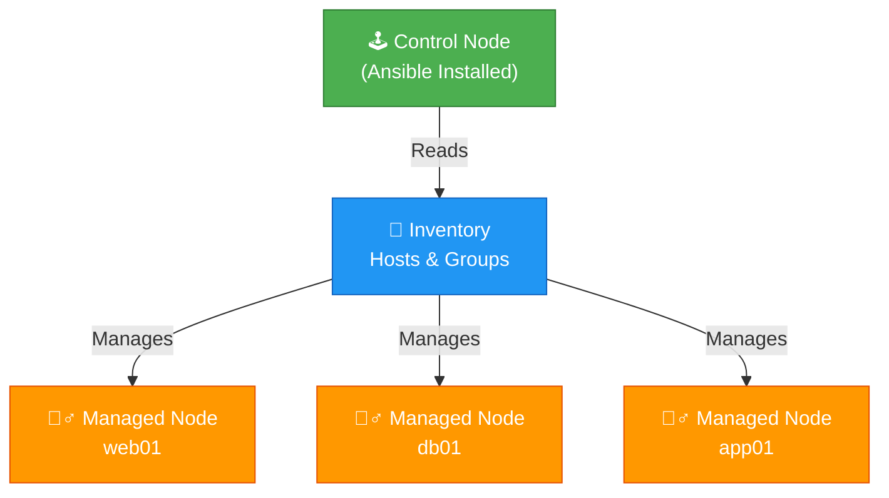
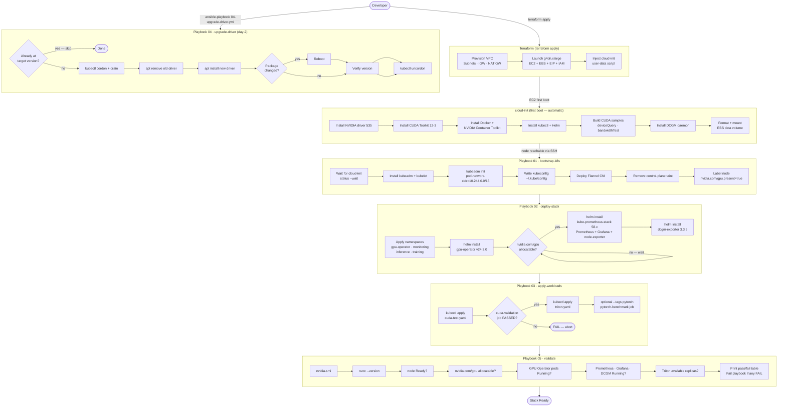

# 🎭 Ansible — NVIDIA SuperPod

Ansible handles everything that happens **after** Terraform provisions the node and **cloud-init finishes its first-boot
setup**. It is the day-1 orchestration layer (Kubernetes bootstrap, Helm deploys) and the day-2 operations layer (driver
upgrades, re-validation).

---

## Prerequisites

```bash
pip install ansible boto3 botocore
ansible-galaxy collection install amazon.aws kubernetes.core
```

| Tool                  | Min version |
|-----------------------|-------------|
| Ansible               | 2.14        |
| Python boto3          | 1.28        |
| amazon.aws collection | 7.x         |

---




## 🕹️ Control Node
> The machine where Ansible is installed and from which automation is executed.
- You run Ansible commands such as ansible or `ansible-inventory` on a `control node`.

$$ \text{Control Node} = Ansible  + Inventory + Playbook$$ 


## 🤹‍♂️ Managed node
> A remote system, or host, that Ansible controls.
- Ansible connects to managed nodes and executes tasks on them.
- Managed nodes do not require Ansible to be installed.


## 📑 Inventory
> A list of `managed nodes` that are logically organized. 
- You create an inventory on the `control node` to describe host deployments to Ansible.


Two inventory sources are provided — use whichever fits your setup:

| File                    | When to use                                                                                                                      |
|-------------------------|----------------------------------------------------------------------------------------------------------------------------------|
| `inventory/aws_ec2.yml` | AWS credentials are configured (`aws configure`). Picks up running EC2 instances tagged `Project=nvidia-superpod` automatically. |
| `inventory/hosts.yml`   | No AWS credentials. Replace `REPLACE_WITH_GPU_NODE_IP` with the value from `terraform output gpu_node_public_ip`.                |

```bash
# Verify dynamic inventory resolves the node
ansible-inventory -i inventory/aws_ec2.yml --list
```

## 📖 Playbooks
> Playbooks are automation blueprints, in YAML format, that Ansible uses to deploy and configure managed nodes.


Run these in order for a fresh deployment. Each playbook is idempotent — safe to re-run.

| # | Playbook                                                   | Purpose                                                                                                 | Become  | Est. time |
|---|------------------------------------------------------------|---------------------------------------------------------------------------------------------------------|---------|-----------|
| 1 | [01-bootstrap-k8s.yml](playbooks/01-bootstrap-k8s.yml)     | Install `kubeadm` + `kubelet`, run `kubeadm init`, deploy Flannel CNI, write kubeconfig, label GPU node | `sudo`  | 3–5 min   |
| 2 | [02-deploy-stack.yml](playbooks/02-deploy-stack.yml)       | Install GPU Operator, kube-prometheus-stack, and DCGM Exporter via Helm                                 | no      | 8–12 min  |
| 3 | [03-apply-workloads.yml](playbooks/03-apply-workloads.yml) | Run CUDA validation job (asserted pass), deploy Triton Inference Server                                 | no      | 2–5 min   |
| 4 | [04-upgrade-driver.yml](playbooks/04-upgrade-driver.yml)   | Day-2: cordon → drain → swap driver package → reboot → uncordon                                         | `sudo`  | 5–10 min  |
| 5 | [05-validate.yml](playbooks/05-validate.yml)               | End-to-end health check across all seven stack layers; prints pass/fail table                           | partial | 1–2 min   |

### What each playbook covers in detail

| Playbook                 | Key tasks                                                                                                                                                                                                                             |
|--------------------------|---------------------------------------------------------------------------------------------------------------------------------------------------------------------------------------------------------------------------------------|
| `01-bootstrap-k8s.yml`   | Wait for cloud-init · install `kubeadm`/`kubelet` · `kubeadm init --pod-network-cidr` · copy kubeconfig · deploy Flannel · remove control-plane taint · label node `nvidia.com/gpu.present=true`                                      |
| `02-deploy-stack.yml`    | Apply `kubernetes/base/namespaces.yaml` · add NVIDIA + prometheus-community Helm repos · install GPU Operator `v24.3.0` · install `kube-prometheus-stack 58.x` (Prometheus + Grafana + node-exporter) · install DCGM Exporter `3.3.5` |
| `03-apply-workloads.yml` | Run `cuda-validation` job · assert "PASSED" in logs · clean up job · deploy Triton Deployment + Service + ServiceMonitor · (optional) run `pytorch-benchmark` job via `--tags pytorch`                                                |
| `04-upgrade-driver.yml`  | Compare current vs target major version · skip if already at target · cordon + drain · `apt remove` old driver · `apt install` new driver · reboot if package changed · verify version · uncordon                                     |
| `05-validate.yml`        | nvidia-smi · nvcc version · node Ready · `nvidia.com/gpu` allocatable · GPU Operator pod statuses · Prometheus/Grafana/DCGM pod statuses · Triton available replicas · structured pass/fail summary                                   |

---

## Usage

### Full deployment (fresh node)

```bash
cd ansible/

ansible-playbook playbooks/01-bootstrap-k8s.yml
ansible-playbook playbooks/02-deploy-stack.yml
ansible-playbook playbooks/03-apply-workloads.yml
ansible-playbook playbooks/05-validate.yml
```

### Run a single playbook against a specific host

```bash
ansible-playbook playbooks/05-validate.yml -l superpod-node-01
```

### Dry run (check mode)

```bash
ansible-playbook playbooks/02-deploy-stack.yml --check --diff
```

### Run the PyTorch benchmark

```bash
ansible-playbook playbooks/03-apply-workloads.yml --tags pytorch
```

### Upgrade driver to 550

```bash
ansible-playbook playbooks/04-upgrade-driver.yml \
  --extra-vars "new_driver_version=550"
```

---

## Variable overrides

All version pins and paths live in `group_vars/gpu_nodes.yml` and mirror the defaults in `terraform/variables.tf`.
Override at the command line without editing files:

```bash
ansible-playbook playbooks/02-deploy-stack.yml \
  --extra-vars "gpu_operator_version=v24.6.0"
```

| Variable                        | Default             | Description                                   |
|---------------------------------|---------------------|-----------------------------------------------|
| `k8s_version`                   | `1.29`              | Kubernetes minor version (apt repo + kubeadm) |
| `driver_version`                | `535`               | NVIDIA driver major version                   |
| `cuda_version`                  | `12-3`              | CUDA toolkit apt suffix                       |
| `gpu_operator_version`          | `v24.3.0`           | GPU Operator Helm chart version               |
| `dcgm_exporter_version`         | `3.3.5`             | DCGM Exporter Helm chart version              |
| `kube_prometheus_stack_version` | `58.7.2`            | kube-prometheus-stack Helm chart version      |
| `grafana_admin_password`        | `superpod-changeme` | Grafana admin password                        |
| `pod_network_cidr`              | `10.244.0.0/16`     | Flannel pod CIDR (must match kubeadm init)    |

---

## Division of responsibility

| Layer                                  | Tool                  | Rationale                                                 |
|----------------------------------------|-----------------------|-----------------------------------------------------------|
| VPC, EC2, EBS, IAM, EIP                | **Terraform**         | Stateful infrastructure — needs a state file              |
| Driver, CUDA, Docker, kubectl install  | **cloud-init**        | Must run before Kubernetes exists; one-shot               |
| Kubernetes cluster init, Helm deploys  | **Ansible**           | Ordered, idempotent, re-runnable after Spot interruptions |
| GPU Operator config, monitoring config | **Helm values files** | Declarative, version-controlled in `kubernetes/`          |
| Training jobs, Triton                  | **kubectl / Ansible** | Ephemeral workloads                                       |


## Flow of Control


