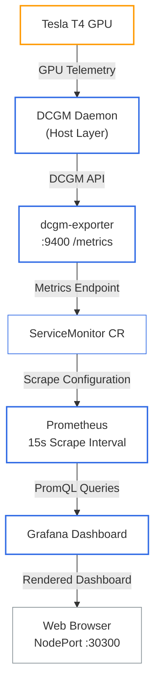

# Architecture — NVIDIA SuperPod Lab

## Overview

The SuperPod Lab provisions a single GPU node on AWS and wraps it in a full enterprise-grade operations stack: infrastructure-as-code, Kubernetes GPU orchestration, and end-to-end observability. The design mirrors the layered architecture of an NVIDIA DGX SuperPod at small scale, making every pattern transferable to production multi-node clusters.

---


## Layer Diagram




```
┌───────────────────────────────────────────────────────────────────┐
│                        AWS Account                                │
│                                                                   │
│  ┌─────────────────────────────────────────────────────────────┐  │
│  │                     VPC (10.0.0.0/16)                       │  │
│  │                                                             │  │
│  │  Public Subnets          Private Subnets                    │  │
│  │  10.0.1.0/24  AZ-a       10.0.10.0/24  AZ-a                 │  │
│  │  10.0.2.0/24  AZ-b       10.0.11.0/24  AZ-b                 │  │
│  │       │                        │                            │  │
│  │       │  IGW               NAT GW ×2                        │  │
│  │       │                                                     │  │
│  │  ┌────▼────────────────────────────────────────────────┐    │  │
│  │  │           g4dn.xlarge  (Tesla T4, 16 GB VRAM)       │    │  │
│  │  │                                                     │    │  │
│  │  │  ┌──────────────┐  ┌─────────────────────────────┐  │    │  │
│  │  │  │  Host Layer  │  │      Kubernetes Layer       │  │    │  │
│  │  │  │              │  │                             │  │    │  │
│  │  │  │ nvidia-535   │  │  gpu-operator  (ns)         │  │    │  │
│  │  │  │ cuda-12.3    │  │  ├─ device-plugin           │  │    │  │
│  │  │  │ docker       │  │  ├─ gfd (node labels)       │  │    │  │
│  │  │  │ nvidia-ctk   │  │  └─ validator               │  │    │  │
│  │  │  │ kubeadm      │  │                             │  │    │  │
│  │  │  │ DCGM daemon  │  │  monitoring  (ns)           │  │    │  │
│  │  │  └──────────────┘  │  ├─ dcgm-exporter :9400     │  │    │  │
│  │  │                    │  ├─ prometheus  :9090       │  │    │  │
│  │  │  ┌──────────────┐  │  └─ grafana    :30300       │  │    │  │
│  │  │  │ EBS gp3      │  │                             │  │    │  │
│  │  │  │ root 100 GiB │  │  inference  (ns)            │  │    │  │
│  │  │  │ data 200 GiB │  │  └─ triton   :30800/30801   │  │    │  │
│  │  │  │  /mnt/data   │  │                             │  │    │  │
│  │  │  └──────────────┘  │  training  (ns)             │  │    │  │
│  │  │                    │  ├─ cuda-validation (Job)   │  │    │  │
│  │  │  Elastic IP        │  └─ pytorch-benchmark (Job) │  │    │  │
│  │  └────────────────────┴─────────────────────────────┘  │    │  │
│  └─────────────────────────────────────────────────────────────┘  │
│                                                                   │
│  CloudWatch: vpc-flow-logs, gpu-util-low, gpu-mem-high,           │
│              gpu-temp-high alarms                                 │
└───────────────────────────────────────────────────────────────────┘
```

---

## Components

### Infrastructure (Terraform)

| Resource | Module | Purpose |
|----------|--------|---------|
| VPC | `modules/vpc` | Isolated network with public/private subnets |
| Internet Gateway | `modules/vpc` | Outbound internet for the public subnet |
| NAT Gateway ×2 | `modules/vpc` | Outbound internet for private subnets (HA pair) |
| VPC Flow Logs | `modules/vpc` | All-traffic logging to CloudWatch for audit |
| EC2 `g4dn.xlarge` | `modules/gpu-node` | GPU node; T4 16 GB VRAM, 4 vCPU, 16 GB RAM |
| EBS root `gp3` 100 GiB | `modules/gpu-node` | OS, drivers, Docker images |
| EBS data `gp3` 200 GiB | `modules/gpu-node` | Model checkpoints, datasets at `/mnt/data` |
| Elastic IP | `modules/gpu-node` | Stable public address across stop/start |
| IAM Role | `modules/gpu-node` | CloudWatch metrics, S3 data bucket, ECR pull |
| SSM policy | `modules/gpu-node` | Agentless SSH alternative via AWS Systems Manager |
| CloudWatch Alarms ×3 | `modules/gpu-node` | GPU idle / memory high / temperature high |

### Cloud-Init Bootstrap (first boot)

The `cloud-init.sh.tpl` template runs once on first boot and installs:

1. NVIDIA driver 535 via apt
2. CUDA Toolkit 12-3 via `cuda-keyring`
3. Docker + NVIDIA Container Toolkit
4. kubectl + Helm
5. Pre-compiled `deviceQuery` and `bandwidthTest` samples
6. DCGM daemon (optional, controlled by `enable_dcgm_exporter`)
7. Data volume formatted and mounted at `/mnt/data`

### Kubernetes Stack

| Namespace | Component | Helm Chart / Source |
|-----------|-----------|---------------------|
| `gpu-operator` | NVIDIA GPU Operator | `nvidia/gpu-operator v24.3.0` |
| `monitoring` | DCGM Exporter | `nvidia/dcgm-exporter 3.3.5` |
| `monitoring` | Prometheus + Grafana | `prometheus-community/kube-prometheus-stack 58.x` |
| `inference` | Triton Inference Server | `nvcr.io/nvidia/tritonserver:24.01-py3` |
| `training` | PyTorch Benchmark | `nvcr.io/nvidia/pytorch:24.01-py3` |
| `training` | CUDA Validation | `nvidia/cuda:12.3.2-base-ubuntu22.04` |

### GPU Operator — What It Manages

Because drivers and the NVIDIA Container Toolkit are pre-installed by cloud-init, `driver.enabled: false` is set. The operator still manages:

- **Device Plugin** — exposes `nvidia.com/gpu` as a schedulable resource
- **GPU Feature Discovery (GFD)** — labels nodes with GPU model, driver/CUDA version, compute capability
- **DCGM** — datacenter GPU manager daemon used by DCGM Exporter
- **Validator** — runs a post-install pod to confirm end-to-end GPU access

### Observability Data Flow




---

## Networking

### Security Group Rules (GPU Node)

| Port | Protocol | Source | Purpose |
|------|----------|--------|---------|
| 22 | TCP | `allowed_cidrs` | SSH |
| 6443 | TCP | `allowed_cidrs` | Kubernetes API |
| 30000–32767 | TCP | `allowed_cidrs` | NodePort services |
| 3000 | TCP | `allowed_cidrs` | Grafana (host) |
| 9090 | TCP | `allowed_cidrs` | Prometheus (host) |
| 9400 | TCP | `allowed_cidrs` | DCGM Exporter (host) |
| 9100 | TCP | self | Node Exporter (intra-cluster) |
| all | all | self | Intra-cluster pod communication |
| all | all | 0.0.0.0/0 | Egress |

> Set `allowed_cidrs` to your specific CIDR in `terraform.tfvars` before deploying. The default `0.0.0.0/0` is intentionally open for lab convenience — restrict it in any shared or production environment.

### IMDSv2

The EC2 metadata service is configured with `http_tokens = required` (IMDSv2) and `http_put_response_hop_limit = 1`. This prevents pods from accessing instance credentials via the metadata endpoint.

---

## IAM Permissions (GPU Node Role)

| Permission | Resource | Purpose |
|-----------|----------|---------|
| `cloudwatch:PutMetricData` | `*` | Push custom GPU metrics |
| `logs:CreateLogGroup/Stream/PutLogEvents` | `arn:aws:logs:*:*:*` | Application logging |
| `s3:GetObject/PutObject/ListBucket` | `superpod-data-{env}` bucket | Training data / checkpoints |
| `ecr:GetAuthorizationToken/BatchGetImage/...` | `*` | Pull private container images |
| SSM Managed Instance Core | AWS managed policy | Session Manager access |

---

## Design Decisions

Design decisions have been extracted into standalone Architecture Decision Records (ADRs):

| ADR | Decision |
|-----|----------|
| [ADR-001](adr/ADR-001-single-node-topology.md) | Single-node topology — one `g4dn.xlarge` exercises the full stack at near-zero Spot cost |
| [ADR-002](adr/ADR-002-driver-preinstall-cloud-init.md) | Driver pre-install via cloud-init — avoids the GPU Operator bootstrap deadlock and DKMS Secure Boot complications |
| [ADR-003](adr/ADR-003-kube-prometheus-stack-bundle.md) | kube-prometheus-stack bundle — pre-wires Prometheus, Grafana, Alertmanager, and ServiceMonitor discovery in one release |
| [ADR-004](adr/ADR-004-ebs-gp3-volumes.md) | EBS gp3 volumes — 3,000 IOPS baseline at gp2 price; both volumes encrypted at rest |
| [ADR-005](adr/ADR-005-elastic-ip-stable-address.md) | Elastic IP for stable addressing — SSH and NodePort URLs survive Spot interruptions |
