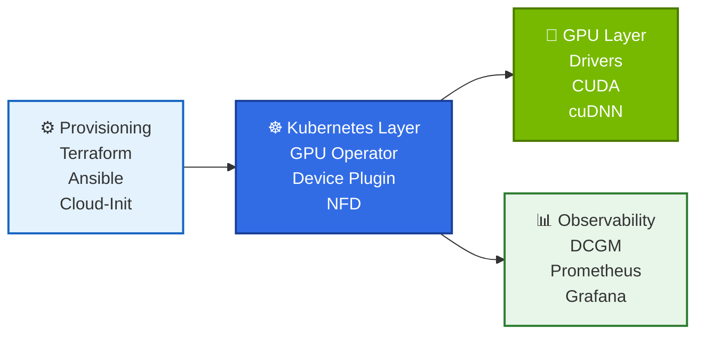
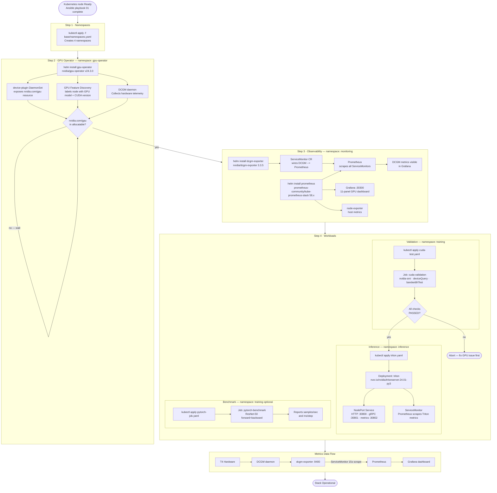

# Kubernetes — NVIDIA SuperPod

All Kubernetes manifests and Helm values for the SuperPod GPU cluster. The stack runs on a single `g4dn.xlarge` node (Tesla T4) bootstrapped by Ansible playbook `01-bootstrap-k8s.yml`.

---




## Directory Structure

```
kubernetes/
├── base/
│   └── namespaces.yaml          # All namespaces — apply first
├── gpu-operator/
│   └── values.yaml              # NVIDIA GPU Operator Helm values
├── dcgm-exporter/
│   └── values.yaml              # DCGM Exporter Helm values
└── monitoring/
    ├── prometheus/
    │   └── values.yaml          # kube-prometheus-stack Helm values
    └── grafana/
        └── dashboards/
            └── gpu-cluster.json # 11-panel GPU metrics dashboard

workloads/                        # Optional — apply after core stack is healthy
├── cuda-test.yaml               # Job: GPU validation (nvidia-smi, deviceQuery, bandwidthTest)
├── pytorch-job.yaml             # Job: ResNet-50 throughput benchmark
└── triton.yaml                  # Deployment + Service + ServiceMonitor
```

---

## Namespace Layout

| Namespace | Contents |
|-----------|----------|
| `gpu-operator` | GPU Operator, device plugin, GFD, DCGM daemon, validator |
| `monitoring` | DCGM Exporter, Prometheus, Grafana, node-exporter |
| `inference` | Triton Inference Server |
| `training` | CUDA validation job, PyTorch benchmark job |

---

## Deployment Workflow



---

## Install Commands

### Step 1 — Namespaces

```bash
kubectl apply -f kubernetes/base/namespaces.yaml
```

### Step 2 — GPU Operator

```bash
helm repo add nvidia https://helm.ngc.nvidia.com/nvidia && helm repo update

# Label the node first (required on single-node clusters)
kubectl label node $(kubectl get nodes -o jsonpath='{.items[0].metadata.name}') \
  nvidia.com/gpu.present=true

helm install gpu-operator nvidia/gpu-operator \
  --namespace gpu-operator \
  --version v24.3.0 \
  -f kubernetes/gpu-operator/values.yaml \
  --wait --timeout=10m

# Verify
kubectl get nodes -o jsonpath='{.items[*].status.allocatable.nvidia\.com/gpu}'
# Expected: 1
```

### Step 3 — Observability

```bash
helm repo add prometheus-community https://prometheus-community.github.io/helm-charts
helm repo update

helm install prometheus prometheus-community/kube-prometheus-stack \
  --namespace monitoring \
  --version 58.7.2 \
  -f kubernetes/monitoring/prometheus/values.yaml \
  --wait --timeout=10m

helm install dcgm-exporter nvidia/dcgm-exporter \
  --namespace monitoring \
  --version 3.3.5 \
  -f kubernetes/dcgm-exporter/values.yaml \
  --wait
```

Access Grafana on **NodePort 30300** — default credentials `admin / superpod-changeme`.

To import the GPU dashboard:
```bash
# Grafana UI → Dashboards → Import → Upload kubernetes/monitoring/grafana/dashboards/gpu-cluster.json
```

### Step 4 — Workloads

```bash
# CUDA validation (run first — aborts if GPU is broken)
kubectl apply -f workloads/cuda/cuda-test.yaml
kubectl wait job/cuda-validation -n training --for=condition=complete --timeout=5m
kubectl logs -n training job/cuda-validation

# Triton Inference Server
kubectl apply -f workloads/triton/triton.yaml
kubectl rollout status deployment/triton -n inference

# PyTorch benchmark (optional)
kubectl apply -f workloads/pytorch/pytorch-job.yaml
kubectl logs -n training job/pytorch-benchmark -f
```

---

## Key Design Decisions

| Decision | Rationale |
|----------|-----------|
| `driver.enabled: false` in GPU Operator | Driver is pre-installed by cloud-init before Kubernetes exists — letting the operator install it again causes a version-check conflict |
| DCGM Exporter in `monitoring` not `gpu-operator` | Co-locates all observability components; the `ServiceMonitor` `release: prometheus` label must match the kube-prometheus-stack release name |
| `serviceMonitorSelectorNilUsesHelmValues: false` | Without this, Prometheus only scrapes ServiceMonitors in its own namespace and silently ignores DCGM |
| Triton uses `hostPath` for model repository | Models are written to `/mnt/data` on the EBS volume by training jobs; Triton reads them directly without a PVC |
| `emptyDir medium: Memory` for `/dev/shm` | Triton and PyTorch use shared memory for zero-copy data transfer; the default 64 MiB `/dev/shm` is too small for GPU workloads |
| NodePort over LoadBalancer | Single-node lab — no cloud load balancer needed; NodePort ports are pinned so URLs stay stable |

---

## Port Reference

| Service | NodePort | Protocol | Path |
|---------|----------|----------|------|
| Grafana | 30300 | HTTP | `/` |
| Triton HTTP | 30800 | HTTP | `/v2/health/ready` |
| Triton gRPC | 30801 | gRPC | — |
| Triton metrics | 30802 | HTTP | `/metrics` |
| Prometheus | ClusterIP only | HTTP | port-forward 9090 |
| DCGM Exporter | ClusterIP only | HTTP | port-forward 9400 |

---

## License
*© 2026 [Hitesh Kumar Sahu](https://hiteshsahu.com) · Licensed under [Apache 2.0](https://www.apache.org/licenses/LICENSE-2.0)*
