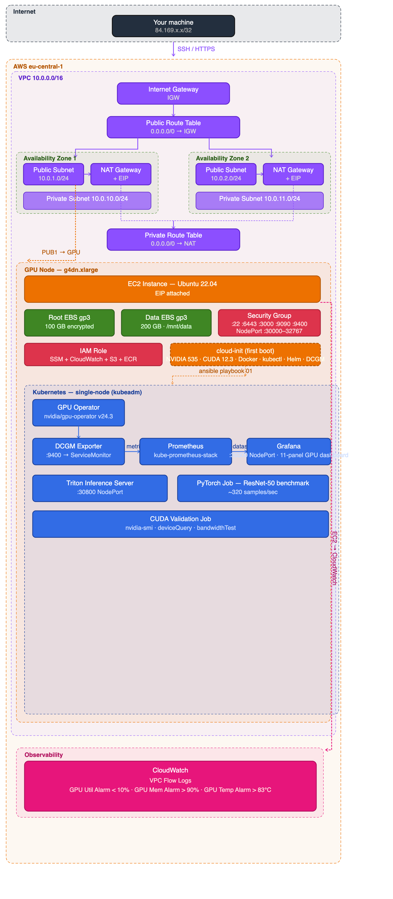

## Deploying Nvidia GPU Cluster on AWS

- Network layer — VPC, public/private subnets across 2 AZs, IGW, NAT Gateways, route tables
- Compute layer — EC2 GPU node with Elastic IP, security group port rules, IAM role
- Storage — root EBS (100 GB) and data EBS (200 GB) both encrypted gp3
- Boot — cloud-init flow installing drivers, CUDA, Docker, kubectl
- Observability — CloudWatch alarms for GPU util, memory, and temperature + VPC flow logs
- Access — your IP locked down to SSH :22, K8s API :6443, and service ports

---

### main.tf : the core infrastructure.

Key design choices:
- Spot instance by default (`use_spot_instance = true`) — cuts cost from ~`$0.53/hr` to ~`$0.16/hr` on a T4, which matters for a lab project
- `IMDSv2 enforced` (http_tokens = "required") — security best practice NVIDIA will notice
- Separate data `EBS volume (200GB)` for datasets and model checkpoints — keeps root volume clean
- `CloudWatch alarm for low GPU` utilization for operational thinking, not just provisioning
- `IAM role with SSM access` — means you can shell in without opening SSH if needed

### variables.tf 
Validation blocks on instance_type and environment are deliberate. 

### outputs.tf 
Includes pre-built SSH command, all dashboard URLs, and a validate_gpu_command output.

After terraform apply you get everything you need printed directly.

---

## License
*© 2026 [Hitesh Kumar Sahu](https://hiteshsahu.com) · Licensed under [Apache 2.0](https://www.apache.org/licenses/LICENSE-2.0)*
